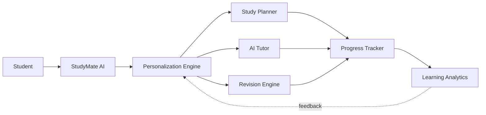

<div align="center">

# 📚 ChatGPT StudyMate AI

### Turning ChatGPT into a proactive AI learning companion for India's competitive-exam students


-E17055?style=flat-square)


**[🔍 Discovery](docs/01-Discovery.md) · [🎯 Define](docs/02-Define.md) · [💡 Develop](docs/03-Develop.md) · [🚀 Deliver](docs/04-Deliver.md) · [🎬 Watch Demo](https://github.com/Rehansheikh787/ChatGPT-StudyMate-AI-/blob/main/demo/demo.mp4)**

</div>

---

## TL;DR

ChatGPT is great at answering isolated questions but does nothing to keep a student *coming back*. This case study reframes it as **StudyMate AI** — a proactive study companion with personalized plans, adaptive revision, an AI tutor, and progress tracking — designed using the **4D framework** (Discover → Define → Develop → Deliver) to solve one problem: turning episodic ChatGPT usage into a daily learning habit for JEE/NEET/board-exam students.

**My role:** Solo AI Product Manager — research, problem framing, prioritization, solution design, prototyping, and go-to-market, end to end.

---

## 📖 Table of Contents

- [The Problem](#-the-problem)
- [Users & Research](#-users--research)
- [Product Strategy](#-product-strategy)
- [The Solution](#-the-solution)
- [User Journey](#-user-journey)
- [AI Architecture](#-ai-architecture)
- [Roadmap](#-roadmap)
- [Success Metrics](#-success-metrics)
- [Demo](#-demo)
- [Repo Structure](#-repo-structure)
- [Key Learnings](#-key-learnings)
- [About Me](#-about-me)

---

## 🔍 The Problem

Students preparing for JEE, NEET, and board exams stitch together their learning from **disconnected tools** — YouTube lectures, coaching-app practice sets, Google searches, isolated ChatGPT questions, and physical notes.

```
YouTube  →  Coaching App  →  Google Search  →  ChatGPT (Q&A only)  →  Notebook
```

Each hop adds cognitive load. ChatGPT answers well, but it's **reactive** — it waits to be asked, remembers nothing about the student's plan, and gives no reason to return tomorrow. The result is episodic usage instead of a daily learning habit.

> Full research writeup: [`docs/01-Discovery.md`](docs/01-Discovery.md)

---

## 👥 Users & Research

Research centered on two personas, validated against Jobs-to-be-Done for the primary segment (14–18-year-old JEE/NEET aspirants) and a secondary segment (parents & teachers who influence but don't drive daily usage).

<table>
<tr>
<td width="50%"></td>
<td width="50%"></td>
</tr>
</table>

<details>
<summary><b>Jobs-to-be-Done map</b> (click to expand)</summary>
<br>

</details>

**Key pain points surfaced:** no structured study plan, no personalized revision, low motivation between sessions, and no visibility into progress.

---

## 🎯 Product Strategy

Using an **Opportunity Solution Tree**, I mapped the desired outcome (raise average ChatGPT sessions/day for JEE/NEET aspirants to 5+) down to concrete product directions, then ran everything through a prioritization matrix to decide what earns a spot in the MVP.


<details>
<summary><b>Feature prioritization matrix</b> (click to expand)</summary>
<br>

</details>

| Opportunity | Priority | In MVP? |
|---|---|---|
| Personalized Study Plan | High | ✅ |
| AI Tutor | High | ✅ |
| Smart Revision | High | ✅ |
| Daily Motivation | Medium | ✅ |
| Parent Dashboard | Low | v2 |
| Peer Learning | Low | v3 |

> Full rationale: [`docs/02-Define.md`](docs/02-Define.md)

---

## 💡 The Solution

**StudyMate AI** wraps four core capabilities around ChatGPT, each designed to close a specific gap found in research.

| Feature | What it does | Why it matters |
|---|---|---|
| 🗓️ **Personalized Study Planner** | Builds a study schedule from exam type, available hours, and weak areas | Replaces guesswork with a structured plan |
| 🤖 **AI Tutor** | Adaptive, conversational explanations with step-by-step solutions | Cuts dependency on scattered YouTube/Google searches |
| 🔁 **Smart Revision** | Recommends revision sessions from learning history and exam dates | Improves retention instead of one-time cramming |
| 📊 **Progress Tracking** | Tracks streaks, topics completed, and revision status | Gives students visibility that sustains motivation |

<p align="center">


</p>

<details>
<summary><b>Full high-fidelity screen set</b> (click to expand)</summary>
<br>

</details>

> Full feature breakdown: [`docs/03-Develop.md`](docs/03-Develop.md)

---

## 🧭 User Journey

Mapping the primary persona's emotional arc — from getting stuck on a problem to resolving it — showed exactly where friction (and opportunity) lives today.


<details>
<summary><b>Secondary persona journey map</b> (click to expand)</summary>
<br>

</details>

---

## 🏗 AI Architecture



**Core AI components:** LLM (ChatGPT) · user profile & preferences · study planner logic · recommendation engine · learning analytics · feedback loop.

> Full architecture notes: [`assets/architecture/ai-architecture.md`](assets/architecture/ai-architecture.md)

---

## 🚀 Roadmap

**MVP** ships Study Planner, AI Tutor, Smart Revision, and Progress Tracking to a pilot group before wider rollout.

| Version | Additions |
|---|---|
| **v1 (MVP)** | Study Planner · AI Tutor · Smart Revision · Progress Tracking |
| **v2** | Parent Dashboard · Advanced Analytics · AI Exam Simulator |
| **v3** | Peer Study Groups · Gamification · Leaderboards |
| **v4** | Voice Tutor · Offline Mode · Career Guidance |

**Key risks:** AI hallucinations, over-dependence on AI, incorrect recommendations, privacy — mitigated through human verification on critical content, transparent AI limitations, and continuous feedback loops.

> Full launch & risk plan: [`docs/04-Deliver.md`](docs/04-Deliver.md)

---

## 📈 Success Metrics

| Category | Metrics |
|---|---|
| **Engagement** | DAU/WAU, sessions per user, session duration |
| **Learning Outcomes** | Study plan completion rate, revision completion rate, weekly consistency |
| **Product Health** | Feature adoption, Day-7/Day-30 retention, AI satisfaction score, NPS |

---

## 🎬 Demo

<p align="center">

</p>

<p align="center"><b><a href="https://github.com/Rehansheikh787/ChatGPT-StudyMate-AI-/blob/main/demo/demo.mp4">▶️ Watch the full walkthrough (demo.mp4)</a></b></p>

---

## 📁 Repo Structure

```
ChatGPT-StudyMate-AI/
├── docs/                   4D case study writeups (Discover → Deliver)
├── assets/
│   ├── personas/           Primary & secondary persona cards
│   ├── journey-maps/       Emotional journey maps
│   ├── diagrams/           JTBD, opportunity tree, prioritization matrix
│   ├── architecture/       AI solution architecture
│   ├── prototype/          High-fidelity screens
│   ├── marketing/          Flyer & launch storybook
│   └── demo/               Demo GIF preview
├── prompts/                Prompts used to drive each research/design phase
└── demo/                   Full product walkthrough video
```

---

## 🎓 Key Learnings

- Structuring ambiguous 0→1 AI product problems with the 4D framework
- Translating user research into a prioritized, MVP-scoped feature set
- Designing AI-native features (personalization, adaptive tutoring) vs. bolting AI onto existing flows
- Balancing user value against feasibility and risk (hallucination, over-dependence, privacy)

---

## 👋 About Me

I'm a **Chemical Engineer transitioning into AI Product Management**, building case studies like this one to apply product thinking, AI-native design, and rapid prototyping to real user problems.

📂 More AI product case studies on my [GitHub profile](https://github.com/Rehansheikh787).

</div>
